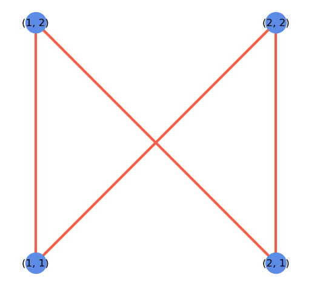
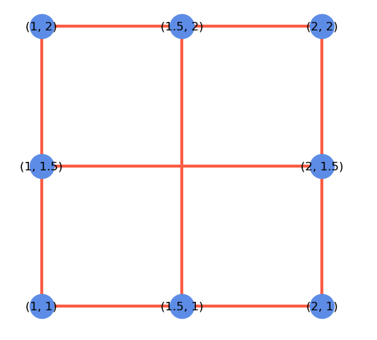

Perimeter product algorithm
===================================

This is my shot at solving the perimeter product problem, having spent some hours on it. Long story short, I use graphs and python. The method works for simple shapes but fails for the edge case provided.

```txt
.
├── 📄 main.ipynb: main jupyter notebook, start here
├── 📄 README.md: this README
├── 📄 main.py: my (failed) attempt at producing a standalone python code. Need more work on 
│      hestus.py
├── 📄 hestus.py: helper functions for plotting, geometry etc
└── 📄 prototyping.ipynb: jupyter notebook showing the prototyping that led to the first
       attempt at a solution. Lots of plots there.
```

## My approach

Tech stack: 

- Python
- Jupyter for prototyping
- `networkx` for handling graphs

## How to run

(1) Open jupyter notebook or jupyter lab:

    jupyter lab

in your computer.

(2) Open notebook `main.ipynb`. Or click in the corresponding file in the github repo. This will not allow, however, to change the geometrical shape.

(3) Specify the desired geometrical shape in cell 8, 

    shape=window

To test the edge case, change it to `shape=mystery`. However, be warned that it fails the edge case. More about this below.

## Problem and solution

### Problem statement

You are given a list of line segments represented as a set of two x,y points.

```
( ((x1, y1), (x2, y2)),
((x3, y3), (x4, y4)), …. )
```

For an example of a simple square:

```
( ((1, 1), (1, 2)),
((1, 2), (2, 2)),
((2, 2), (2, 1)),
((2, 1), (1, 1)), )
```

The final result we wish to calculate is to find the multiplicative product of all perimeters of all the individual enclosed areas. For the example above, it is straightforward where there is only one enclosed area that has a perimeter of 4. So the final answer is 4.

For a stranger shape, we draw an hourglass shape:

```
( ((1, 1), (1, 2)),
((1, 2), (2, 1)),
((2, 1), (2, 2)),
((2, 2), (1, 1)), )
```

<p align="center">
  
</p>

Note: There are two areas, but we do not explicitly write the intersection point at the neck of the hourglass.

Each individual triangle has a perimeter of ~2.4142 or ( 1+sqrt(2) ), so the product of all perimeters is 5.82842 or (3 + 2 * sqrt(2)). Note, we expect the floating point solution, not the exact values. They are there just for illustrative purposes.

For a more complex shape, we draw a window:

```
( ((1, 1), (1, 2)),
((1, 2), (2, 2)),
((2, 2), (2, 1)),
((2, 1), (1, 1)),
((1.5, 1), (1.5, 2)),
((1, 1.5), (2, 1.5)), )
```

<p align="center">
  
</p>


In this example there are 4 areas each with a perimeter of 2. Making the final answer 16.

Note: We do NOT double count the larger original square, nor the 4 possible rectangles.

Please submit your code and the solution to our test cases. You can assume that there are no dangling edges (a line that is not part of an area).

Please feel free to use the programming language of your choice.

Please find the multiplicative perimeter product for the following points:

```
( ((1, 1), (1, 2)),
((1, 2), (1.8, 2)),
((1.8, 2), (1.8, 1)),
((1.8, 1), (1, 1)),
((1.2, 1), (1.2, 2)),
((1.6, 1), (1.6, 2)),
((1, 1.5), (1.6, 1.8)),
((1, 1.3), (1.8, 1.7)),
((1.2, 1.2), (1.8, 1.5)), )
```

### Algorithm outline

When looking at a geometrical shape, our eyes immediately realize the intersections between lines and the geometrical "subshapes" they form. However, the computer has no idea about the potential intrincate closed shapes. We need to use geometry to teach the machine to identify these shapes. 

Here are the three basic steps in my algorithm to solve the problem:

1. **Find intersections**: first we find the intersecting points between the lines that define the input geometrical figure. This is essential to build up the subshapes for later processing.
2. **Define new segments**: we establish new edges (already using graph language) in addition to those of the original shape.
3. **Identify closed regions**: we use the minimum cycle basis for undirected graphs to find building-block cycles (i.e. the subgraphs), with the information we gathered in steps 1 and 2. This is based in the Horton algorithm.

Underpinning the approach is the heavy use of graphs via the `networkx` python library.

This approach finds the correct answer for the simple shapes provided: square, hourglass and window. However, it fails for the edge case provided. More about this in the "edge case" section below. 

### Edge case

My approach fails to get an answer for the complicated "mystery" shape provided in the exercise. 

My suspicion for the cause of the failure is related to how it gets the intersections. 

